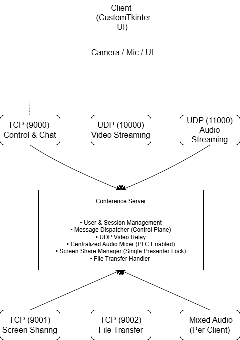

# 🚀 ConnectSphere – Multi-User LAN Video Conferencing System

**ConnectSphere** is a real-time, multi-user video conferencing system built using low-level network programming in Python.

The project demonstrates practical use of TCP & UDP protocols, concurrency, media streaming, and system-level design—similar in concept to platforms like Zoom or Google Meet, but implemented from scratch for learning and experimentation.

---

## 🎯 Project Objective
To design and implement a scalable LAN-based conferencing system that supports:
* Real-time video and audio communication
* Screen sharing
* File transfer
* Public & private messaging

All while maintaining clear protocol separation, concurrency handling, and performance optimizations.

---

## 🧩 Real-World Motivation

Modern video conferencing systems require a careful balance between **latency, reliability, and scalability**.  
This project explores how real-world platforms like Zoom and Google Meet:

- Use **UDP** for real-time media to minimize delay
- Use **TCP** where reliability is critical (chat, file transfer, screen sharing)
- Separate **control-plane traffic** from **media-plane traffic**

ConnectSphere was built to understand and implement these trade-offs at a **low level**, without relying on high-level frameworks like WebRTC.

---

## ✨ Key Features

### 🔹 Real-Time Video Conferencing
* **Protocol:** UDP for low-latency video streaming.
* **Mechanism:** Video frames are JPEG-encoded, fragmented, and reassembled.
* **Capability:** Supports multiple participants simultaneously.

### 🔹 Real-Time Audio Mixing
* **Protocol:** UDP for audio packets.
* **Mechanism:** Server performs centralized audio mixing. Each client receives a custom mix excluding their own audio.
* **Optimization:** Includes packet loss concealment (PLC) to reduce audio dropouts.

### 🔹 Screen Sharing
* **Protocol:** TCP for reliable screen transmission.
* **Model:** Enforces a single-presenter model.
* **Function:** Streams screen frames to all viewers in real time.

### 🔹 Chat & Reactions
* **Public Chat:** Available for all participants.
* **Private Messaging:** Secure one-to-one messaging.
* **Reactions:** Emoji reactions broadcast in real time.

### 🔹 File Transfer
* **Protocol:** TCP.
* **Function:** Supports file upload to server and download by participants.
* **Reliability:** Ensures reliable and complete file delivery.

---

## 🧠 System Architecture (High Level)

### Client–Server Model
* **Server Manages:**
    * User state
    * Media routing
    * Audio mixing
    * Screen sharing control
* **Clients Handle:**
    * Media capture (camera, mic, screen)
    * UI rendering
    * Media playback

### Threaded & Modular Design
* Each major function runs in a dedicated thread.
* UI is decoupled from networking to prevent freezing.
* Queue-based communication between threads.

---

## 🏗️ System Architecture Diagram

The following diagram illustrates the high-level architecture of ConnectSphere, showing the separation between the **control plane** and **media plane**, along with the protocols used for each communication path.



**Legend:**
- **TCP (Control Plane):** Reliable communication for chat, commands, screen sharing, and file transfer.
- **UDP (Media Plane):** Low-latency transport for video and audio streams.

---

## 🧠 Key Design Decisions

- **Centralized Audio Mixing:**  
  Chosen to simplify synchronization and allow per-client customized audio streams.

- **UDP for Media Streams:**  
  Packet loss is preferable to delay in real-time communication.

- **Thread-per-Responsibility Model:**  
  Ensures UI responsiveness and isolates failures in media pipelines.

- **Single Presenter Lock for Screen Sharing:**  
  Prevents bandwidth overload and simplifies viewer synchronization.

---
## 🔌 Communication Protocols

| Feature | Protocol | Reason |
| :--- | :---: | :--- |
| **Control & Chat** | TCP | Reliable, ordered delivery |
| **Video Streaming** | UDP | Low latency, real-time |
| **Audio Streaming** | UDP | Minimal delay |
| **Screen Sharing** | TCP | Reliability required |
| **File Transfer** | TCP | Data integrity |

---

## 🛠️ Technologies Used

* **Language:** Python
* **Networking:** Socket Programming (TCP & UDP)
* **Concurrency:** Threading & Synchronization
* **GUI:** CustomTkinter
* **Video:** OpenCV (capture & encoding)
* **Audio:** NumPy (mixing), PyAudio (real-time I/O)
* **Screen Capture:** Pillow / MSS

---

## ▶️ How to Run

### 1. Prerequisites
Install the required libraries:
  ```bash
  pip install customtkinter opencv-python numpy pillow mss pyaudio
  ```

### 2. Run the Server
Start the central server first:
  ```Bash
  python server.py
  ```
3. Run the Client
Launch the client application:
  ```Bash
  python client.py
  ```
Note: To connect multiple users, run the client script on different machines and connect using the server’s LAN IP.

---

## 📊 Scale & Performance Characteristics

- Tested with **multiple concurrent clients** on a LAN
- Supports:
  - Continuous video streaming
  - Real-time audio mixing at fixed intervals
  - Simultaneous chat and file transfer
- Designed to handle **high I/O concurrency** using multithreading

---

## 🧪 Limitations & Future Enhancements
* **Encryption:** Currently no encryption; can be extended with TLS / DTLS.
* **Network:** LAN-only; can be extended using NAT traversal / TURN for WAN support.
* **Codecs:** Video codec can be upgraded to H.264 or WebRTC-style implementation.

---

## 📚 Academic Context
* **Course:** Computer Networks
* **Focus Areas:**
    * Socket programming
    * Protocol design
    * Concurrency
    * Real-time communication
  
---

## 👨‍💻 Author

**Ravi Tejesh N**  
Computer Science & Engineering  
Specialization: *Artificial Intelligence*
